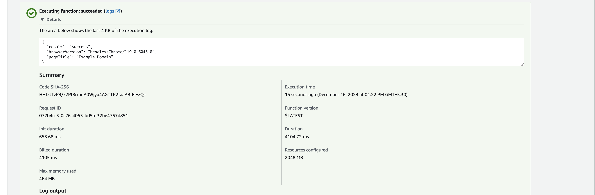
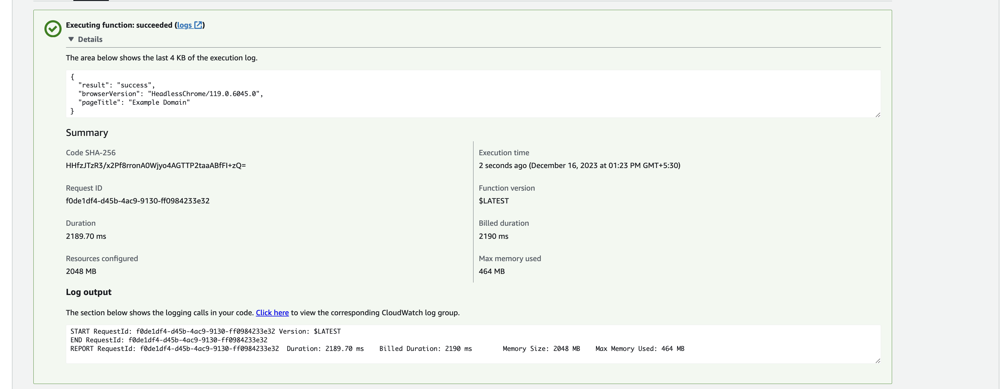

# Working with Puppeteer or Selenium on Docker and Lambdas
As a developer, you might have come across a situation where you need to run a headless browser in a serverless environment like AWS Lambda or Google Cloud Functions. This is a common requirement when you need to scrape a website or generate a PDF from a webpage. Running in a headless browser in a serverless environment can be challenging because of the limitations of the environment. I'll share what we did when i am writing applications that need chromium to be accessible in docker or serverless envs.

## What is the difference that came with envs
If you want to run pupeteer on AWS Lambda in headless mode, there are a couple of obstacles that you have to overcome.

1.The binary included in the pupeteer project won’t work in the lambda environment, since it is missing a couple of shared libraries 

2.There is a size limit on how big your deployed lambda can be. This means that we can’t just include another binary and execute it directly.


## Puppeteer on Lambdas and Cloud Functions (Serverless Env)

[Sparticuz](https://github.com/Sparticuz/chromium) is a project that provides a headless Chromium binary optimized for AWS Lambda environments and Google Cloud Functions. It addresses the challenge of running headless browsers, in serverless environments where traditional approaches (like adding the chrome binary itself in fs, or downloading the chrome binary on each run) are not feasible due to memory constraints and lack of GUI support.

### Javascript Usage

functions/Scraper/index.mjs
```javascript
import chromium from '@sparticuz/chromium';
import puppeteer from 'puppeteer-core';

export const lambdaHandler = async (event, context) => {
  const browser = await puppeteer.launch({
    args: chromium.args,
    defaultViewport: chromium.defaultViewport,
    executablePath: await chromium.executablePath(),
    headless: chromium.headless,
  });

  const page = await browser.newPage();

  await page.goto("https://www.example.com", { waitUntil: "networkidle0" });

  const browserVersion = await browser.version();
  const pageTitle = await page.title();

  await page.close();

  await browser.close();

  return { result: 'success', browserVersion, pageTitle };
}
```
functions/Scraper/package.json
```json
{
  "name": "Scraper",
  "private": true,
  "version": "0.1.0",
  "description": "AWS Lambda Function that loads Chromium. Refer to https://github.com/Sparticuz/chromium#install for compatible versions.",
  "main": "app.mjs",
  "devDependencies": {
    "@sparticuz/chromium": "^119.0.0"
  },
  "dependencies": {
    "puppeteer-core": "^21.5.1"
  }
}
```
layers/chromium/package.json
```json
{
  "name": "ChromiumLayer",
  "private": true,
  "version": "1.0.0",
  "description": "Chromium layer for AWS Lambda",
  "dependencies": {
    "@sparticuz/chromium": "^119.0.0"
  }
}
```
template.yaml
```yaml
AWSTemplateFormatVersion: "2010-09-09"
Transform: AWS::Serverless-2016-10-31
Description: Chromium with Node.js integration for AWS Lambda

Resources:
  ChromiumLayer:
    Type: AWS::Serverless::LayerVersion
    Properties:
      Description: Chromium with Node.js integration for AWS Lambda
      ContentUri: layers/chromium
      CompatibleRuntimes:
        - &nodejsRuntime nodejs18.x
      # Chromium doesn't currently have ARM support; see https://github.com/Sparticuz/chromium#can-i-use-arm-or-graviton-instances so we need to use x86_64
      CompatibleArchitectures:
        - &chromiumArch x86_64
      RetentionPolicy: Delete
    Metadata:
      BuildMethod: *nodejsRuntime
      BuildArchitecture: *chromiumArch

  ExampleFunction:
    Type: AWS::Serverless::Function
    Properties:
      CodeUri: functions/Scraper
      Handler: app.lambdaHandler
      Runtime: *nodejsRuntime
      Architectures:
        - *chromiumArch
      Layers:
        - !Ref ChromiumLayer
      Timeout: 30
      MemorySize: 1024
```

### Performance

The performance of the headless browser in a serverless environment is not as good as running it on a dedicated server. This is because the serverless environment has a cold start time, which can be several seconds. This means that the first time you run the headless browser in a serverless environment, it will take longer to start up than subsequent runs. However, once the headless browser is running, it should perform reasonably well.

Here is a basic invocation time taken by the lambda function

**Initial Run** (Cold Start Effect)

[](../assets/images/chromium-initial-run.png)

**Subsequent Runs**

[](../assets/images/chromium-second-run.png)

## Puppeteer on Docker
So, in docker, we can actually run chromium easier way, just few extra installations on docker file should be enough

Here is a template docker file that i use for running puppeteer on docker

```Dockerfile
FROM node:latest

# Set working directory
WORKDIR /app

# Install Puppeteer dependencies
RUN apt-get update && apt-get install -y wget gnupg \
    && apt-get install -y \
        gconf-service \
        libasound2 \
        libatk1.0-0 \
        libc6 \
        libcairo2 \
        libcups2 \
        libdbus-1-3 \
        libexpat1 \
        libfontconfig1 \
        libgcc1 \
        libgconf-2-4 \
        libgdk-pixbuf2.0-0 \
        libglib2.0-0 \
        libgtk-3-0 \
        libnspr4 \
        libpango-1.0-0 \
        libpangocairo-1.0-0 \
        libstdc++6 \
        libx11-6 \
        libx11-xcb1 \
        libxcb1 \
        libxcomposite1 \
        libxcursor1 \
        libxdamage1 \
        libxext6 \
        libxfixes3 \
        libxi6 \
        libxrandr2 \
        libxrender1 \
        libxss1 \
        libxtst6 \
        ca-certificates \
        fonts-liberation \
        libappindicator1 \
        libnss3 \
        lsb-release \
        xdg-utils

# Add the Google Chrome repository
RUN wget --quiet --output-document=- https://dl-ssl.google.com/linux/linux_signing_key.pub | gpg --dearmor > /etc/apt/trusted.gpg.d/google-archive.gpg \
    && sh -c 'echo "deb [arch=amd64] http://dl.google.com/linux/chrome/deb/ stable main" >> /etc/apt/sources.list.d/google.list'

# Install Google Chrome
RUN apt-get update && apt-get install -y google-chrome-stable

# Cleanup
RUN rm -rf /var/lib/apt/lists/* \
    && apt-get purge --auto-remove -y wget gnupg

WORKDIR /app
COPY . .
RUN npm install
```

and then you can use the chromium in your js file like this

```javascript
const puppeteer = require('puppeteer');
const browser = await puppeteer.launch({
  headless: "new",
  args: ["--no-sandbox", "--disable-setuid-sandbox"],
});
const page = await browser.newPage();

await page.goto("https://www.example.com", { waitUntil: "networkidle0" });

const browserVersion = await browser.version();
const pageTitle = await page.title();

await page.close();

await browser.close();

return { result: 'success', browserVersion, pageTitle };
```

